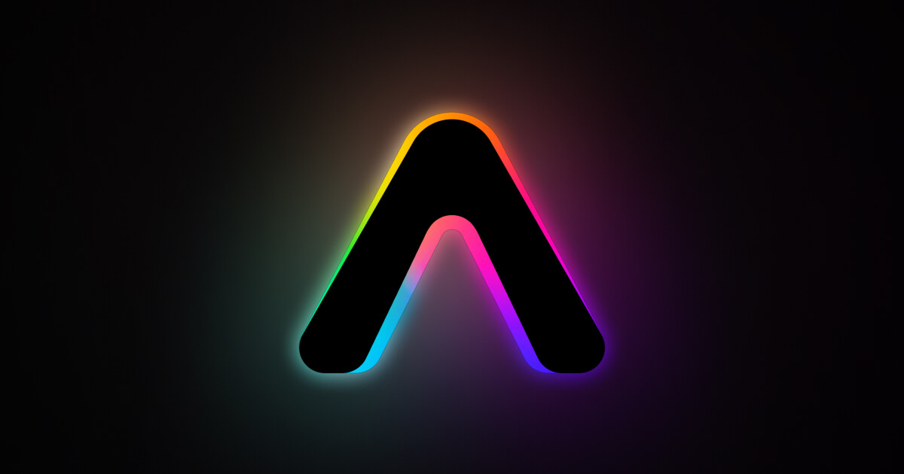

<a href="https://amplo.ale.design">
  
</a>

<h1 align="center">Amplo Fill Picker</h1>

<p align="center">
  OKLCH-native, Display-P3-aware color and gradient picker for shadcn/ui. Every format toggle is a lossless round-trip, every pick tells you which gamut it landed in, and the whole thing installs with one CLI command.
</p>

<p align="center">
  
  
  
  
  
  <a href="./LICENSE"></a>
</p>

<p align="center">
  <a href="https://amplo.ale.design"><b>Live demo →</b></a> &nbsp;·&nbsp;
  <a href="https://amplo.ale.design/docs"><b>Docs →</b></a> &nbsp;·&nbsp;
  <a href="https://amplo.ale.design/playground"><b>Playground →</b></a> &nbsp;·&nbsp;
  <a href="https://amplo.ale.design/docs/changelog"><b>Changelog →</b></a>
</p>

---

Most React color pickers are sRGB-only: they can't reach the colors a modern
display can show, they don't tell you when a pick falls outside sRGB, and they
don't surface contrast metrics. This one stores every color as **OKLCH**, paints
in **Display-P3** where the device supports it, and marks the gamut cutoffs
right on the picking surface. Color today, gradients now, images and video on
the way — composable, accessible, gamut-aware.

## Quick start

Install whichever entry point fits — deeper ones pull the lighter ones in as
registry dependencies.

```sh
# Base UI (default — plain names, matching shadcn's Base-UI-first registry):
# Solid color only
pnpm dlx shadcn@latest add https://amplo.ale.design/r/color-picker.json

# Add gradient editing (pulls color-picker)
pnpm dlx shadcn@latest add https://amplo.ale.design/r/gradient-picker.json

# Color + gradient + a switcher (pulls both above) — the "give me everything" default
pnpm dlx shadcn@latest add https://amplo.ale.design/r/fill-picker.json

# Radix / shadcn-classic variants:
pnpm dlx shadcn@latest add https://amplo.ale.design/r/color-picker-radix.json
pnpm dlx shadcn@latest add https://amplo.ale.design/r/gradient-picker-radix.json
pnpm dlx shadcn@latest add https://amplo.ale.design/r/fill-picker-radix.json
```

Everything dedupes by `target`, so reaching for a deeper entry point later is
idempotent. Base UI parts land in `components/ui/fill-picker-base/`; the shared
engine and Radix parts in `components/ui/fill-picker/`.

```tsx
import { ColorPicker } from "@/components/ui/fill-picker-base/color-picker";

<ColorPicker.Root defaultValue="oklch(0.7 0.18 30)">
  <ColorPicker.Area mode="oklch-cl" />
  <ColorPicker.Hue />
  <ColorPicker.ChannelInput />
</ColorPicker.Root>
```

Full layouts, props, and copy-paste recipes live in the
**[docs](https://amplo.ale.design/docs)** and the
**[playground](https://amplo.ale.design/playground)**.

## Two variants, one engine

The **Base UI** variant rebuilds the interactive parts (Hue/Lightness/Alpha sliders, FormatSwitcher, ChannelInput, Swatches, and the gradient TypeSwitcher/InterpSwitcher/StopList and friends) on [Base UI](https://base-ui.com) primitives, and is the main variant going forward. The classic variant keeps the original Radix-backed shadcn parts. Both share the same OKLCH engine, compound API, and presentational parts, so fixes propagate to both. The docs default to Base UI at [`/docs`](https://amplo.ale.design/docs); the Radix variant lives at [`/docs/radix`](https://amplo.ale.design/docs/radix), one click away via the toggle.

## What's in this repo

| Path | What |
|------|------|
| [`registry/new-york/fill-picker-base`](./registry/new-york/fill-picker-base) | The **Base UI variant** — the default. Rebuilds the interactive parts on Base UI primitives; imports the shared engine and presentational parts from `color-picker/`. |
| [`registry/new-york/color-picker`](./registry/new-york/color-picker) | The shared **OKLCH engine** plus the original Radix-backed parts. Bundled into the registry artifact and consumed by both variants. |
| [`src`](./src) | The Next.js site at [amplo.ale.design](https://amplo.ale.design) — landing demo, docs, and playground. Not shipped to consumers. |
| [`registry.json`](./registry.json) | Source of truth for what ships. A part missing here isn't installed, however importable it is in the demo site. |

---

## Why

- **OKLCH-canonical** — all color state is stored as OKLCH so format toggles (hex / rgb / hsl / hsb / oklch / oklab / display-p3) are lossless round-trips.
- **Display-P3 rendering** — when the device reports `(color-gamut: p3)`, the saturation canvas is painted in `display-p3` color space; out-of-sRGB swatches and previews paint in their native gamut on capable displays. The default output format is `p3`.
- **Stretched-gamut fill + warning lines** — the 2D Area always fills with in-gamut color: the active render gamut is stretched to the square's edges, and narrower-gamut cutoffs are drawn as thin warning lines *inside* the fill. Render gamut tracks the output format (hex/rgb/hsl/hsb → sRGB, p3 → P3, oklch/oklab → Rec.2020) and is overridable per `<ColorPicker.Area gamut="..." />`. Live `<GamutBadge>` confirms where the picked color lands, with a hover tooltip.
- **Live contrast metrics with rich popover** — WCAG 2.1 ratio + AA/AAA badges and APCA Lc + body/headline badges, surfaced one at a time. Hovering the readout opens a popover that shows every threshold (with a green ✓ or red ✗ icon) and the foreground/background pair being tested. When more than one metric is enabled the readout becomes a clickable toggle to flip between WCAG and APCA.
- **Mode-aware hue slider** — when the active format is HSL or HSB the slider tracks that format's hue scale (so the bead matches the channel input H exactly); for OKLCH/OKLab it tracks canonical OKLCH hue with chroma rescaling on commit; hex/RGB/P3 fall back to OKLCH hue.
- **Compose-only API** — Radix-style compound parts. There is no kitchen-sink default component; you build the layout you need.
- **shadcn-native styling** — uses semantic tokens (`bg-popover`, `border-input`, `ring-ring`, etc.), Geist Sans + Mono via `next/font`, identical input/select/button visuals to the rest of your shadcn project.
- **Accessible** — full keyboard control on every part (arrow keys with shift modifier, Home/End, PageUp/PageDown), proper `aria-valuetext`, focus rings, touch-friendly pointer capture, color-independent status (text + icons, not just hue).

---

## A full layout

```tsx
"use client";

import * as React from "react";
import { ColorPicker, parseColor } from "@/components/ui/fill-picker-base/color-picker";

export function Example() {
  const [color, setColor] = React.useState(() => parseColor("oklch(0.7 0.18 30)")!);
  return (
    <ColorPicker.Root
      value={color}
      onValueChange={setColor}
      backgroundColor="#ffffff"
    >
      <div className="flex items-stretch gap-2">
        <ColorPicker.GamutBadge showLabel={false} className="w-auto flex-1 justify-center" />
        <ColorPicker.ContrastReadout
          metrics={["wcag", "apca"]}
          showLabel={false}
          showValue={false}
          className="w-auto flex-1 justify-center"
        />
      </div>
      <ColorPicker.Area mode="oklch-cl" />
      <div className="flex flex-col gap-1.5">
        <ColorPicker.Hue />
        <ColorPicker.Alpha />
      </div>
      <div className="flex items-center gap-2">
        <ColorPicker.FormatSwitcher className="flex-1" />
        <ColorPicker.EyeDropper className="h-8 w-full flex-1" />
      </div>
      <ColorPicker.ChannelInput showFormat={false} />
      <ColorPicker.Swatches />
    </ColorPicker.Root>
  );
}
```

The [playground](https://amplo.ale.design/playground) ships eight named variants (Canonical, Compact, Minimal, Sliders only, Area only, Framer, Figma, A11y review, Brand swatches) and emits the JSX for each layout — copy-paste from there.

---

## API

### `<ColorPicker.Root>`

| Prop              | Type                                             | Default     | Description |
| ----------------- | ------------------------------------------------ | ----------- | ----------- |
| `value`           | `string \| OklchColor`                           | —           | Controlled value. Any CSS Color 4 string or canonical OKLCH object. |
| `defaultValue`    | `string \| OklchColor`                           | —           | Uncontrolled initial value. |
| `onValueChange`   | `(color: OklchColor, formatted: string, formats: Record<ColorFormat, string>) => void` | — | Fires on every change. `formats` includes a pre-serialized string in every format. |
| `format`          | `ColorFormat`                                    | —           | Controlled output format. |
| `defaultFormat`   | `ColorFormat`                                    | `"p3"`      | Uncontrolled initial format. |
| `onFormatChange`  | `(format: ColorFormat) => void`                  | —           | Fires on format toggle. |
| `formats`         | `ColorFormat[]`                                  | all         | Restricts which output formats the picker exposes (FormatSwitcher options + the resolved default). |
| `backgroundColor` | `string \| OklchColor`                           | `"#fff"`    | Background used for contrast metrics + Preview composite. |

`ColorFormat` = `"hex" \| "rgb" \| "hsl" \| "hsb" \| "oklch" \| "oklab" \| "p3"`.

### Parts

| Part | Notable props | Notes |
| --- | --- | --- |
| `<ColorPicker.Area>` | `mode`, `gamut`, `chromaMax`, `showWarningLines` | 2D canvas. `mode = "oklch-cl"` (perceptually uniform: Y = OKLCH lightness, top row white, max-saturation at the gamut cusp), `"hsv-sv"` (HSV-style: top-left white, top-right fully saturated, like Photoshop / Framer), `"oklch-hc"` (hue × chroma; pair with `<ColorPicker.Lightness>`). All modes always fill the square with in-gamut color; narrower-gamut cutoffs render as thin SVG warning lines. Defaults to `h-45 w-full` (180px tall, fills picker width). Keyboard: arrows ±1%, Shift+arrows ±10%, Home/End, PgUp/PgDn. |
| `<ColorPicker.Hue>` | `orientation` | Hue slider. Mode-aware (see above). |
| `<ColorPicker.Lightness>` | `orientation` | Lightness slider — pair with `mode="oklch-hc"` Area. |
| `<ColorPicker.Alpha>` | `orientation` | Opacity slider with checkerboard. |
| `<ColorPicker.Preview>` | — | 40px swatch composited over `backgroundColor`. |
| `<ColorPicker.CssInput>` | — | Single text input. Parses any CSS Color 4 string on Enter/blur, marks invalid via `aria-invalid`. Escape reverts. |
| `<ColorPicker.FormatSwitcher>` | `formats` | Native `<select>` of formats — pass `formats` to override the list locally. |
| `<ColorPicker.ChannelInput>` | `formats`, `showFormat` | Photoshop-style multi-field input: format selector + one numeric field per channel + alpha %. Set `showFormat={false}` to drop the inline selector when pairing with a standalone `<FormatSwitcher>`. Each numeric field supports ↑/↓ to step (Shift = big step) and accepts a pasted CSS color string. |
| `<ColorPicker.Swatches>` | `presets`, `onAdd` | Grid of preset chips. `presets` accepts any CSS color strings (including wide-gamut `color(display-p3 …)` — they paint in their native gamut on capable displays). When `onAdd` is provided, renders a "+" tile that calls `onAdd(color, hex)`; the consumer owns persistence (lift `presets` and update on add — localStorage / a server / a store / etc.). Transparent presets show a checkerboard underlay. |
| `<ColorPicker.GamutBadge>` | `showLabel` | Live status: sRGB / P3 / Rec.2020 / Out of gamut. Hover tooltip names the active color space. `showLabel={false}` drops the "Gamut" prefix. |
| `<ColorPicker.ContrastReadout>` | `metrics`, `defaultMetric`, `showLabel`, `showValue`, `showBadges` | Surfaces one contrast metric at a time. `metrics: ("wcag" \| "apca")[]` defaults to `["wcag"]`; when length > 1 the readout becomes a button that cycles. Hover opens a popover listing every threshold with ✓ / ✗ icons + the foreground/background pair being tested. Toggle `showLabel` / `showValue` / `showBadges` to slim down the inline display — set everything but `showBadges` to `false` for a minimal pass/fail badge. |
| `<ColorPicker.EyeDropper>` | — | Native `EyeDropper` API. Renders nothing on unsupported browsers. |

### Hook

`useColorPicker(props)` powers the headless layer. Useful when you want a totally custom UI but the same state machine.

```ts
const {
  color,           // canonical OklchColor
  format,
  formatted,       // string in `format`
  formats,         // ColorFormat[] — the list of allowed output formats
  formatStrings,   // Record<ColorFormat, string> — every format pre-serialized
  gamut,           // GamutInfo
  contrast,        // { wcag, wcagLevel, apca }
  setColor,        // accepts string | OklchColor
  setComponent,    // ('l'|'c'|'h'|'alpha', value) — clamped
  adjustComponent, // ('l'|'c'|'h'|'alpha', delta) — wraps for hue
  setFormat,
  setFromString,   // (s) => boolean; false on parse failure
  background,
} = useColorPicker({
  defaultValue: "#ff0000",
  defaultFormat: "p3",
  backgroundColor: "#fff",
  formats: ["hex", "oklch", "p3"], // optional; defaults to all
});
```

### Color utilities

```ts
import {
  parseColor,    // (string) => OklchColor | null
  formatColor,   // (OklchColor, ColorFormat) => string  (sRGB/P3 outputs are gamut-mapped first; hex is uppercased)
  formatAll,     // (OklchColor) => Record<ColorFormat, string>
  gamutInfo,     // (OklchColor) => { inSrgb, inP3, inRec2020 }
  toGamut,       // (OklchColor, "srgb"|"p3"|"rec2020") => OklchColor (CSS Color 4 chroma reduction)
  contrast,      // (fg, bg) => { wcag, wcagLevel, apca }
  apcaContrast,  // (fg, bg) => Lc number
  isValidColor,  // (string) => boolean
} from "@/components/ui/fill-picker-base/color-picker";
```

---

## Color spaces — quick primer

- **sRGB** — the baseline web gamut. Every device made in the last 30 years can render it. Hex / `rgb()` / `hsl()` all live here.
- **Display-P3** — Apple's wide-gamut space. Every recent iPhone, iPad, and MacBook supports it; many newer Android phones too. About 25% wider than sRGB, especially in reds and greens. Use `color(display-p3 r g b)` syntax.
- **OKLCH** — perceptually uniform polar space. The same chroma value looks equally vivid across all hues, and the same lightness looks equally bright. This is why all picker state is stored here — sliders feel intuitive and conversions don't drift. CSS Color 4: `oklch(L C H)`.
- **OKLab** — same color space as OKLCH but in cartesian (a/b) form. Good for color-difference math, less good for UIs.

When you author a P3 or wider color and the user's display can't render it, the browser falls back. `<GamutBadge>` and the warning lines on `<Area>` keep you informed: in `p3` mode the area fills with P3 colors and a single thin line marks the sRGB cutoff; in `oklch`/`oklab` mode the area fills up to Rec.2020 and *two* thin lines mark the sRGB and P3 cutoffs. In sRGB-targeted formats (`hex`/`rgb`/`hsl`/`hsb`) the area fills with sRGB only — no warning line is needed because every visible pixel is also an sRGB color.

---

## Accessibility

- **Keyboard** — every interactive part is reachable via Tab. Sliders follow the [WAI-ARIA APG slider pattern](https://www.w3.org/WAI/ARIA/apg/patterns/slider/) (arrow keys ±1, Shift ±10, Home/End, PageUp/Down). The 2D Area uses `role="application"` with `aria-roledescription` and `aria-valuetext` describing the current point.
- **Pointer + touch** — pointer capture so drags don't escape the slider/area; `touch-none` to suppress browser scroll while interacting.
- **Focus** — visible focus ring on all controls via `focus-visible:ring`.
- **Color independence** — gamut and contrast information is conveyed via text + icons + ARIA, not color alone. Pass/fail badges have hover tooltips and accessible names ("AA passes" / "AA fails").
- **Reduced motion** — no auto-animation; only a swatch hover scale that respects user preference.

---

## Saving user swatches

`<ColorPicker.Swatches>` keeps persistence the consumer's job — pass `onAdd` and lift the `presets` array.

```tsx
const STARTERS = ["#ffffff", "#000000", "oklch(0.7 0.18 30)"];

const [saved, setSaved] = React.useState<string[]>([]);

return (
  <ColorPicker.Swatches
    presets={[...STARTERS, ...saved]}
    onAdd={(_color, hex) => {
      setSaved((prev) => prev.includes(hex) ? prev : [...prev, hex]);
      // Or hit your server: fetch("/api/swatches", { method: "POST", body: JSON.stringify({ hex }) })
      // Or persist locally: localStorage.setItem("swatches", JSON.stringify([...saved, hex]))
    }}
  />
);
```

---

## Local development

This repo is managed with **pnpm** — the lockfile is pnpm's and deploys build
from it. Use pnpm here even if your own apps use something else.

```bash
pnpm install         # install deps
pnpm dev             # run the site → http://localhost:3000
pnpm build           # production build (runs registry:build first)
pnpm lint            # next lint
pnpm typecheck       # tsc --noEmit
pnpm test            # vitest, single run (test:watch for watch mode)
pnpm registry:build  # regenerate public/r/<item>.json from registry.json
```

The `new-york` segment in the registry paths is the shadcn style identifier.
`public/r/*.json` is a build artifact and gitignored; the site has to be
redeployed for consumers to see a registry change.

---

## License

[MIT](./LICENSE) © Alexandre Schrammel
